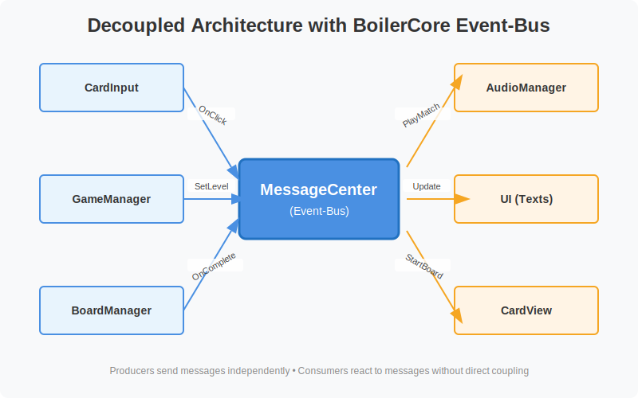
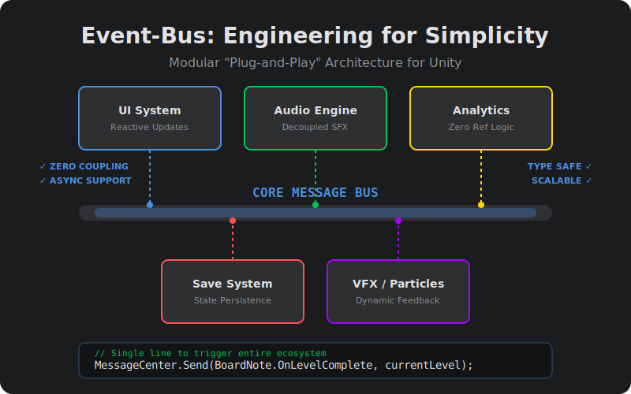

# Unity Hidden Cards - Core Architecture

This project serves as a demonstration of a high-performance, decoupled **Event-Bus System** (`MessageCenter`) in Unity. The architecture is designed for scalability, making it incredibly simple to add new features without modifying existing logic.

---

## 🛠️ Engineering for Simplicity
The Event-Bus allows for a **Plug-and-Play** ecosystem. Adding new systems like Analytics, Save Systems, or VFX takes only a single line of code, with zero dependencies on your core game loop.

## 🚀 Core Engine: [BoilerCore](https://github.com/kamal01k/BoilerCore)
The foundational messaging system is powered by **BoilerCore**. In this project, we are specifically utilizing its **Event-Bus System** to act as the "nervous system" of the game.

### **Key Advantages**
- **Complete Decoupling:** Components never talk to each other directly.
- **Type Safety:** Using `MsgID<T>` eliminates casting errors.
- **Async Ready:** Native support for `async/await` patterns.
- **Scalability:** Add modules (Analytics, VFX, etc.) without touching existing code.

## 🎮 Game Source: [UnityCardGame](https://github.com/kamal01k/UnityCardGame)
The gameplay and logic were originally developed in the **UnityCardGame** repository. This project demonstrates the architectural evolution from tight coupling to a clean, message-driven design.

---

## 🏗️ Project Structure
- **img/**: Architecture diagrams and engineering visuals.
- **Core/**: Foundational Event-Bus system (from BoilerCore).
- **HiddenCards/**: Reactive memory game implementation.

---
*This project demonstrates the power of modular design by combining BoilerCore's architecture with UnityCardGame's logic.*
